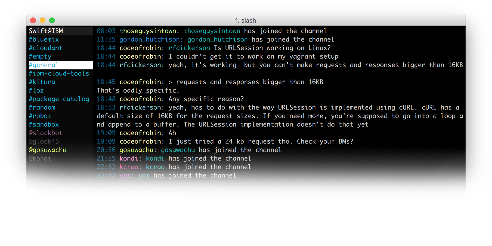
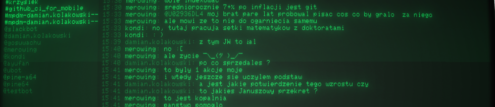

Slash is Slack terminal client written in Swift.

</br>


## Getting started

To use `slash` install it via:

`brew install https://raw.githubusercontent.com/slash-hq/slash/master/slash.rb` 

and start it by running:

```
slash
```

Slash can be used with the [development token](https://api.slack.com/docs/oauth-test-tokens) too:

```
slash <token>
```

## Keys

```
Enter  : Send a message
Tab    : Switch channel
Up/Down: Scroll messages
Ctrl-C : Quit
```

## Retro mode

Thanks too [cool-retro-term](https://github.com/Swordfish90/cool-retro-term) project slash can run in retro mode



## Issues

Please make sure to read the Issue Reporting Checklist before opening an issue. Issues not conforming to the guidelines may be closed immediately.

## How to contribute?

1. Fork this repository and clone to your Mac.
1. Open `slash.xcodeproj` in Xcode
1. Build
1. Open `Terminal` and run `<DerivedData>/Build/Products/Debug/slash`
1. Make your changes, test and submit pull request!

## FAQ

1. Can I connect to multiple Slack teams?

  Yes, simply start multiple `slash` instances and login to a different team in each of them.

## License

Apache License, Version 2.0
